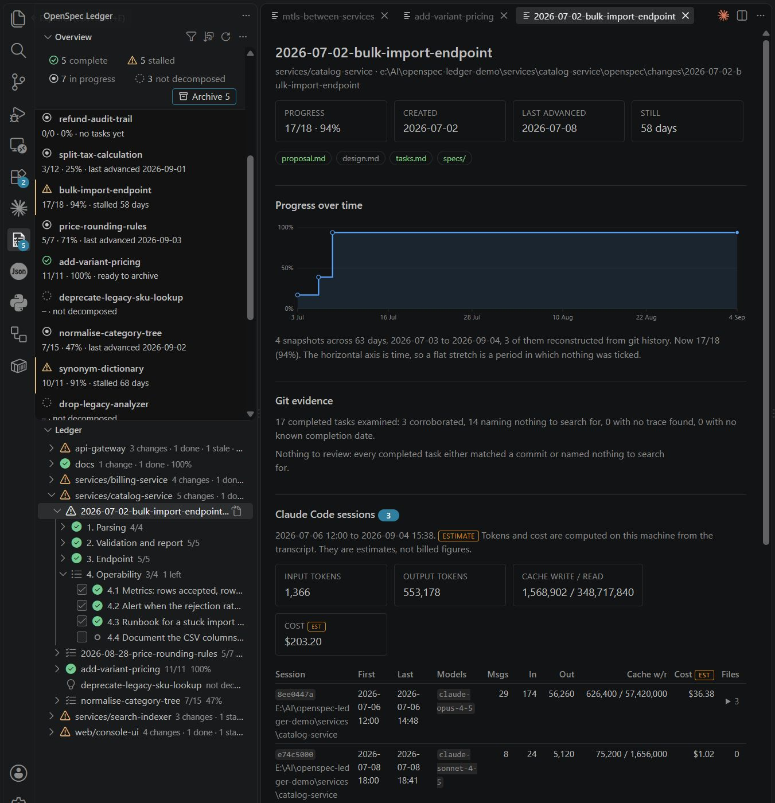

# OpenSpec Ledger

**OpenSpec answers one project at a time, in the present tense. This answers all of them, over
time.**



> ### Works with your agent, whichever one that is
>
> **Claude Code** — sessions, cost and the files they actually edited, read from the transcripts
> on your own machine. Hand a task straight to a Claude Code terminal.
>
> **GitHub Copilot** — hand a task to Copilot Chat with one click, with the change, the task and
> its file already in the prompt.
>
> Everything else works with no agent at all.


`openspec list` is per-project: it reads the directory you are standing in. Seven Marketplace
extensions render the same thing inside the editor, and all of them look for `openspec/` at the
workspace root. If your work lives in one repository and you run the CLI often, you may not need
this at all — that is said up front, because most comparisons of this kind are not honest about it.

If it does not, here is what changes.

### “What is the state of everything?”

The reference workspace holds **14 `openspec/` roots, nine of them in sibling repositories three
levels down** inside a single opened folder. Measured today:

| | `openspec list` | OpenSpec Ledger |
|---|---|---|
| Invocations to see it all | **14**, one per project | 1 view |
| Time | **9.9 s** (706 ms each, one failed outright) | 0.5–0.9 s |
| Result | 14 separate lists | one tree, one badge, one ranking |
| Cross-project total, or “what is stuck everywhere” | not possible | the point of the thing |
| Kept up to date | rerun it and remember to | watches the files, refreshes itself |

Every Marketplace extension finds **zero** changes in that layout, because none of them looks
deeper than a workspace folder root.

### “Is this change still moving, or did it die in July?”

A percentage has no time axis. `61/63` finished yesterday and `61/63` abandoned four months ago
render identically everywhere else — same bar, same number, same colour.

`openspec list` does print a date, so it is worth being precise about what that date is. The field
behind it is `lastModified` — a filesystem timestamp. In `lookup-service` it reads:

```
add-lookup-provider        ✓ Complete      lastModified 2026-02-13T07:45:50.696Z
implement-lookup-service   109/110 tasks   lastModified 2026-02-13T07:45:50.696Z
spec-consistency-fixes     No tasks        lastModified 2026-02-13T07:45:50.696Z
```

Three different changes, one timestamp, identical to the millisecond — the signature of a
`git clone`, not of work. Touching `proposal.md`, switching branch or letting an agent rewrite a
file all reset it. It cannot answer “how long has this been stuck”, because it is not measuring
that.

OpenSpec Ledger keeps a dated snapshot of every change, **backfilled from `git log` on first run**
so the history exists the moment you install it rather than a fortnight later. From that comes a
sort mode called *stalled longest*, a warning icon on anything that has stopped, and a movement
report that says what advanced this week and what did not.

> On the reference workspace this immediately surfaced `implement-lookup-service` at 109/110
> — **stalled 203 days**. One task short, four months untouched, and indistinguishable from healthy
> work in every other tool.

### “Is that ticked box backed by anything?”

In agent-driven development the agent writes the code *and ticks its own box*. A `- [x]` is a
character in a markdown file, and every existing extension takes it at face value.

Two independent records already sit on your disk and can corroborate it: the git history, and — if
you use Claude Code — the transcripts. This extension reads both and reports what it finds as a
signal to review, never as an accusation.

---

## The comparison, plainly

| | `openspec` CLI | The seven extensions | OpenSpec Ledger |
|---|---|---|---|
| Current progress per change | yes | yes | yes |
| Covers many projects at once | **no** — one per invocation | **no** — workspace root only | **any depth, all at once** |
| Lives in the editor, refreshing itself | no — a command you rerun | yes | yes |
| Remembers yesterday | **no** — only a file mtime | **no** | dated snapshots, backfilled from git |
| Sort by *how long it has been stuck* | **no** | **no** | yes |
| What moved this week | **no** | **no** | movement report |
| Completed changes nobody archived | you can spot them by eye | **no** | badge, filter, archive action |
| Ticked box checked against the commits | **no** | **no** | optional, off by default |
| Work attributed to the agent session | **no** | **no** | optional, off by default |
| Validation, spec merge, archiving mechanics | **yes** | no | **no — it calls the CLI** |

The last row matters: this extension does not replace `openspec`. `archive` folds a change's spec
deltas into `openspec/specs/`, so the archive action writes `openspec archive <name>` into a
terminal for you to run rather than reimplementing it.

### It counts differently from the CLI, and says so

Measured against `openspec` 1.2.0: the CLI counts **top-level task lines only** and **ignores the
`[-]` and `[~]` in-progress markers** entirely. This extension counts **leaf tasks** — a parent is
an aggregate of its children, so counting both double-counts — and puts started work in the total
rather than reporting it as untouched.

Neither is wrong; they answer different questions. But two tools showing different numbers for the
same file destroys trust in both, so wherever the figures disagree the panel **shows both** and
names the reason, instead of leaving you to find this paragraph.

---

## Why, in numbers

Measured on the reference workspace — 14 roots under a single opened folder — on 2026-09-04:

| Observation | Count |
|---|---|
| `openspec/` roots — nine of them in sibling repositories under one opened folder | 14 |
| Active changes | 33 |
| Changes at 100 % still sitting in `changes/`, never archived | 8 |
| Changes one task short of done | 8 |
| Changes with no `tasks.md` at all | 4 |
| Open tasks in `indexer` alone | 329 of 340 |
| Claude Code transcripts on the machine | 461 files, 711 MB |
| …of those, transcripts naming an `openspec/changes/<name>` path | 73 |
| References to `openspec/changes/<name>` across them | 3,353 |
| Changes with at least one Claude Code session bound to them | 29 of 33 |

No existing extension finds any of those roots: they look for `openspec/` at the workspace root or
group by opened folder. None of them remembers yesterday, so a change at 61/63 finished yesterday
looks identical to one abandoned in July. And none of them verifies anything.

---

## What it does

### 1. Discovery in depth

`openspec/` roots are found at **any nesting level** beneath the open folders. The reference
topology puts nine of them in sibling repositories three levels down inside a single opened folder;
every other extension finds zero changes there.

A root is accepted when it has `openspec/config.yaml` **or** `openspec/changes/`, so a hand-made or
Stores-style layout is not rejected. Roots outside the workspace can be added by absolute path
through `openspecLedger.additionalRoots`.

Discovery runs off the activation path and honours `files.exclude`, `search.exclude` and the usual
build directories.

### 2. Movement

One progress snapshot per change per day, kept in extension storage — never in your repositories.

On first run the history is **backfilled from `git log`**: every commit that touched a `tasks.md` is
replayed through the same parser, so the full progress curve exists immediately rather than after a
fortnight of collecting. That is what makes *stalled longest* a sort mode you can act on, and what
gives the git evidence layer a date to search around.

### 3. Git corroboration — off by default

For each completed task, the file paths and code symbols named in the task's own text are extracted,
and the repository is searched for a commit **after the tick** that touched them.

Three states exist: *corroborated*, *no references to check*, and *no trace found*. Only the last is
surfaced, together with the references searched, the date window, and the exact `git` commands
behind it — so you can disagree in one click and dismiss it.

This is a heuristic and is presented as one. Refactors rename things, a task can legitimately touch
files it does not name, and squashed history loses the window. Nothing here is ever phrased as an
accusation, and the layer ships disabled until you have judged its accuracy on your own repositories.

### 4. Claude Code provenance — off by default

Which sessions worked on a change, when, at what estimated cost, and **which source files they
actually edited**, read from the transcripts Claude Code already writes to `~/.claude/projects`.

From this comes the sharper signal: *a task ticked on a day when the only session working on the
change edited nothing outside `openspec/`*. Unlike the git heuristic, that one does not have to
guess at wording.

This is not reproducible by the incumbents, which integrate with Copilot — it leaves no comparable
on-disk record.

**Privacy.** Transcripts are read locally, only derived aggregates and file paths are displayed,
prompt and response text never is, nothing is transmitted anywhere, and the whole layer is off
unless you turn it on.

### 5. Getting work moving again

- Tick a checkbox in the tree and it is written back to `tasks.md` as one line, through a workspace
  edit that undo reverses. The line is re-read first: if an agent has changed the file underneath,
  the edit is abandoned rather than applied to the wrong line.
- Hand a task — or a whole section's remaining tasks — to a Claude Code terminal. The prompt is sent
  **without a trailing newline**, so you read it and press Enter yourself. Clipboard fallback
  included.
- A **movement report** over any period: what moved, what did not, and how long each change has been
  still.

---

## Screenshots

*Coming in the next release.*

---

## Install

**From the Marketplace.** Open the Extensions view, search for *OpenSpec Ledger*, and install
`bartosz-warzocha.openspec-ledger`. The Ledger view appears in the Activity Bar as soon as a folder
containing an `openspec/` root is open; nothing else has to be configured.

**From a `.vsix`.** Take the file from the
[releases page](https://github.com/bartoszwarzocha/openspec-ledger/releases), or build one yourself
with `npm run vsix`, then:

```bash
code --install-extension openspec-ledger-0.1.0.vsix
```

VS Code 1.104 or later is required. Both evidence layers are off until you turn them on, so a fresh
install runs no git command for evidence and opens no transcript.

---

## Settings

| Setting | Default | What it does |
|---|---|---|
| `openspecLedger.additionalRoots` | `[]` | Absolute directory paths searched in addition to the open folders. Use it for a repository you have not opened. A path that does not exist is logged once and skipped. |
| `openspecLedger.sortMode` | `name` | Initial ordering: `name`, `progress`, `nearest-done`, `stalled`, `created`. The mode chosen from the view title is remembered per workspace and wins over this. |
| `openspecLedger.gitEvidence.enabled` | `false` | Look for a commit corroborating each completed task. While off, **no git command is run for evidence purposes**. |
| `openspecLedger.claudeEvidence.enabled` | `false` | Read Claude Code transcripts for session, cost and edited-file attribution. While off, **no transcript file is opened**. |
| `openspecLedger.handoff.command` | `claude` | Command used to start Claude Code when a handoff has to create a terminal. |
| `openspecLedger.handoff.template` | `""` | Overrides the handoff prompt. Placeholders: `{change}`, `{number}`, `{task}`, `{tasksPath}`, `{line}`, `{proposal}`. |

---

## Commands

All are under the **OpenSpec Ledger** category.

| Command | Where |
|---|---|
| Refresh | View title |
| Sort Changes By… | View title |
| Show Only Changes Ready to Archive / Show All Changes | View title |
| Movement Report | View title menu, command palette |
| Rescan Claude Code Transcripts | View title menu, command palette |
| Open Change Detail | Change context menu |
| Reveal Change Folder | Change context menu |
| Hand Task to Claude Code · Copy Task Prompt | Task context menu, pending and in-progress tasks only |
| Hand Section to Claude Code | Section context menu, sections with remaining work only |
| Configure Additional Roots | Empty-state link, command palette |
| Show Log | View title menu |

---

## Privacy

**What it reads.** The `openspec/` files under your open folders and under any
`openspecLedger.additionalRoots`, and the git history of each `tasks.md`, which is what the progress
curve is backfilled from. With `openspecLedger.claudeEvidence.enabled` turned on it also reads the
transcripts Claude Code already writes under `~/.claude/projects`; with it off, no transcript file
is opened. With `openspecLedger.gitEvidence.enabled` off, no git command is run for evidence
purposes. **Both evidence layers ship disabled.**

**What it writes.** Exactly two things: the checkbox line you toggle, written back to `tasks.md` as
a single-line workspace edit that undo reverses, and its own history file in the extension's storage
directory — never inside your repositories. Nothing else in your tree is touched.

**What leaves the machine.** Nothing. There is no network call, no telemetry and no account. Of what
is read, only derived aggregates and file paths are ever displayed; prompt and response text from a
transcript never is.

---

## What it deliberately does not do

Authoring proposals, specs or designs. Running the OpenSpec CLI. Archiving. Any agent other than
Claude Code. A composite "health score" — the three evidence sources are shown side by side and you
draw the conclusion.

---

## Measured

Every budget in `design.md` was checked against the reference workspace on 2026-09-04, with
`node scripts/reference-check.ts "D:\work\projects"`. Numbers from that run:

| Operation | Budget | Measured |
|---|---|---|
| Discovery across 14 roots in 9 repositories | < 1 s | **513–858 ms** |
| Parsing one `tasks.md` of 145 tasks | < 10 ms | **0.1 ms** (median of 50) |
| Full model rebuild, 33 changes, nothing changed | < 250 ms | **3.8–5.2 ms** |
| Cold model build, 33 changes / 919 leaf tasks | — | 11–662 ms |
| Backfill of one change | < 2 s | **139–264 ms** |
| Transcript scan, cold, 483 files / 711 MB | — | **3.7–4.2 s** (441 read, 42 skipped as older than 30 days) |
| Transcript scan, warm | < 1 s | **47–53 ms** |

Ranges are across repeated runs; the wider ends were measured while the machine was also running
the test suite.

Two things the design did not anticipate, both worth knowing before trusting a signal:

- **The transcript corpus is 711 MB, not the ~100 MB assumed.** The mtime-and-size cache and the
  thirty-day skip carry more weight than expected; the warm path is what keeps this usable.
- **There is very little `tasks.md` history to replay.** Across the 29 task files in git
  repositories there are 85 commits in total — a *median of one commit per file*, and 18 of the 29
  have only one; one change (`route-reads-through-data-service`) has 37. Movement curves are
  therefore coarse for most changes. Completion *dates*, however, survive this: a single commit
  still dates every task that was complete at it, so git evidence had a window for **every** task
  it looked at (0 % undated), which is more than the design expected.

### Why the git evidence layer ships disabled

Task 8.14 asked for this to be a measured decision, not a preference. Running the layer over the
whole reference workspace (`node scripts/evidence-check.ts`) evaluated **553 completed tasks**
in 88 s:

| Result | Count | Share |
|---|---|---|
| corroborated | 344 | 62.2 % |
| no references to check | 125 | 22.6 % |
| **no trace found** (the only state surfaced) | **84** | **15.2 %** |
| completion date unknown | 0 | 0 % |

Reading all 84 by hand, the surfaced results are dominated by references that were never going to
appear in a commit's file list or its diff *as written*: CSS selectors (`.app-form`, `:root`,
`app-ctl-`), JSON-schema and OpenAPI keys (`$ref`, `x-lookup`, `dependsOn`), single generic
words that happened to sit in an inline-code span (`var`, `row`, `key`, `header`, `cell`), tool
names (`tsc`, `npx`), and in three cases the change's own directory name. Genuine signals are in
there — a task naming `record-create.page.ts` and `formPassesGuards` that no commit in its
window touched is worth a look — but they arrive mixed with enough noise that a reader would learn
to skip the list.

That is the definition of a signal that has lost trust, so **`openspecLedger.gitEvidence.enabled`
defaults to `false`**, and the layer runs no git command at all until you turn it on. The obvious
improvement is a narrower symbol grammar (reject selectors, schema keys and bare English words);
until that is measured, the honest default is off.

**`openspecLedger.claudeEvidence.enabled` also defaults to `false`**, for a different reason: it
reads files containing your prompts. Nothing leaves the machine and no prompt text is displayed,
but reading them at all should be your decision, not a default. On accuracy it needs no such
apology — it binds 29 of the 33 changes to real sessions by exact path match, with no heuristic
involved.

Two things it deliberately will not do. A model id that matches no entry in the price table
contributes **zero** and is listed as unpriced, rather than being estimated at its family's rates:
a cost shown beside evidence has to be traceable to a published price or visibly absent. And the
files a session is credited with are only those inside the change's own repository — an agent also
writes scratch scripts to the temp directory and notes elsewhere, and counting those would let a
session that wrote nothing but a throwaway script suppress the checked-without-code signal.

## Requirements

- VS Code 1.104 or later.
- `git` on `PATH` for history backfill and git evidence. Without it those two degrade to an
  explained empty state and everything else works.

---

## Building from source

```bash
npm install          # local, no global installs
npm run compile      # type-check, lint, bundle to dist/extension.js
npm test             # 366 unit tests, run straight from TypeScript by Node
npm run vsix         # produces openspec-ledger-<version>.vsix
```

The tests need no editor and no download: Node runs the TypeScript directly, so the whole suite is
a matter of seconds. Anything that must touch `vscode` is confined to a handful of thin files
(`view/tree.ts`, `view/detail.ts`, `view/overviewPanel.ts`, `view/writeback.ts`,
`handoff/terminal.ts`, plus `discovery/vscodeSearch.ts` and the wiring), and every judgement they
act on lives in a pure module beside them.

Four scripts measure the extension against a real tree of roots rather than a fixture. All are
read-only and write only into the system temp directory:

```bash
node scripts/reference-check.ts  "D:\work\projects"        # every performance budget
node scripts/tree-preview.ts     "D:\work\projects" stalled # the tree the view renders
node scripts/report-preview.ts   "D:\work\projects" 90      # a movement report
node scripts/evidence-check.ts   "D:\work\projects"         # git evidence, counted by state
```

---

## Contributing

Issues and pull requests are welcome at
<https://github.com/bartoszwarzocha/openspec-ledger>. A bug report is most useful with the output of
**OpenSpec Ledger: Show Log** and the shape of the tree it was run against.

`npm test` is the gate: run it before opening a pull request, along with `npm run compile`, which
type-checks, lints and bundles. Both have to be clean. New judgement belongs in a pure module with
tests beside it rather than in one of the files that touch `vscode` — that separation is what keeps
the suite runnable without an editor.

---

## Prior art

| Extension | Installs | What it does |
|---|---|---|
| OpenSpec (Codder13) | ~8,537 | CodeLens "Start task", pushes context into the AI chat |
| OpenSpec Task Viewer (e1roy) | ~201 | Sidebar tree, `[n/m]`, nested checkboxes, jump to line |
| spek — OpenSpec Viewer | — | Read-only viewer, worktree aggregation |
| OpenSpecCodeExplorer, OpenSpec for Copilot, OpenSpec for VSCode, vscode-openspec | — | Variations on browsing and Copilot handoff |

## Known risks

- Git corroboration is a heuristic and will produce false positives on refactors. It ships disabled
  until measured; a distrusted signal is worse than none.
- OpenSpec's own answer to multi-repo is Stores (beta), a separate planning repository. If adopted it
  makes recursive discovery unnecessary — but leaves the evidence layers intact, since they bind to
  change names rather than paths.
- The transcript format is internal to Claude Code. The layer is optional and depends only on fields
  the sibling `claude-statusbar` project has relied on across many versions.

## Licence

MIT.
